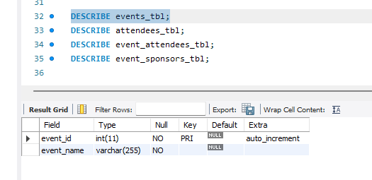
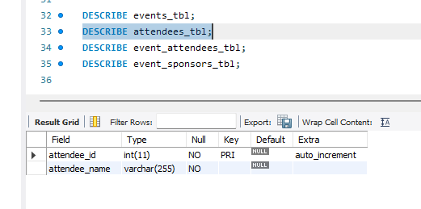
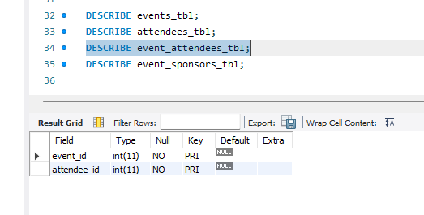
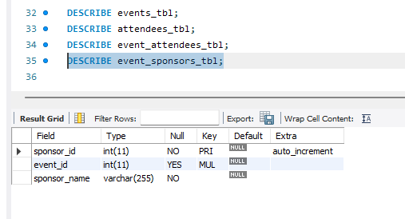
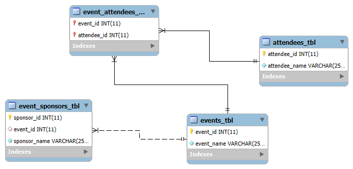

# Finals Lab Task 1: MYSQL Basics (Event Management)

## Task Description:
The goal is to design and implement a simple relational database using MySQL statements. The database consists of four main tables: events, attendees, event attendees, and event sponsors. Each table demonstrates key database concepts such as primary keys, foreign keys, composite keys, and relationships.

## Task Steps:
- Create events table with event_id and event_name.
- Create attendees table with attendee_id and attendee_name.
- Create event_attendees table to connect events and attendees (many-to-many).
- Create event_sponsors table with sponsor details linked to events.
- Generate ER Diagram and export full SQL structure using phpMyAdmin or MySQL Workbench.

# MySQL Query Statements (Output 1)

# Table Structure Screenshots (Output 2)

# Events Table

# Attendees Table

# Event Attendees Table

# Event Sponsor Table

# ER Diagram (Output 3)

# SQL Copy of the Database (Output 4) ->> [Event Management](https://github.com/bangshiki/EDM-Portfolio/blob/09a1318eff4aefbe153213bf757f113d13d1b18c/Final%20Task%201/files/Event_Management.sql)
