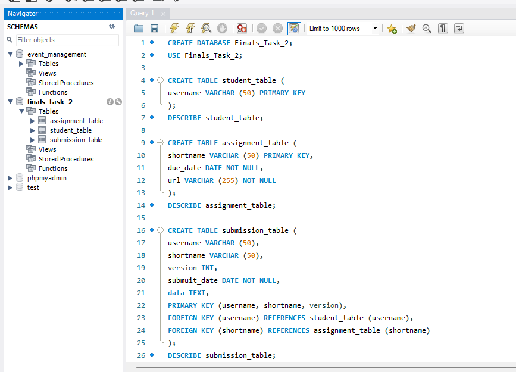
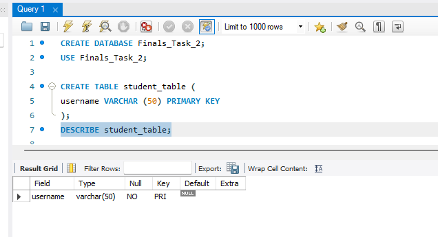
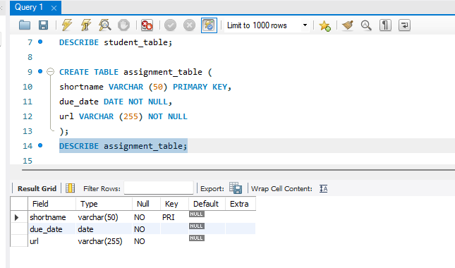
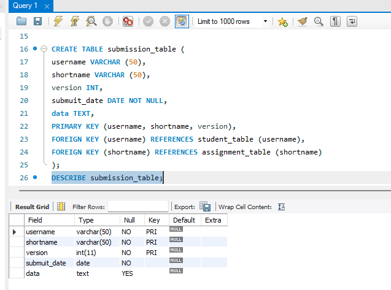
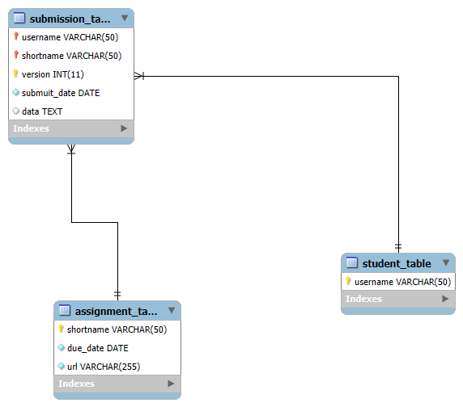

# Finals Lab Task 2: Transforming ER into Relational Tables

## Task Description:
The objective is to transform an er diagram representing student assignment submissions into a mysql based relational schema. This task demonstrates use of entities, relationships, primary keys, foreign keys, and composite keys to model a real-world system.

## Task Steps:
- Create student table with username as primary key
- Create assignment table with shortname, due_date, and optional url
- Create submission table containing: student reference (username), assignment reference (shortname), version, submit date, and data
- Define referential integrity constraints
- Generate er diagram and export full sql structure using phpmyadmin or mysql workbench

# MySQL Query Statements

# Table Structure Screenshots
# Student Table

# Assignment Table

# Submission Table

# ER Diagram

# SQL Copy of the Database ->> [Transforming ER into Relational Tables](https://github.com/bangshiki/EDM-Portfolio/blob/392359b35c1c809c5b02e8b5abd0ccefa1d9d3a1/Finals%20Task%202/files/Finals%20Task%202.sql)
