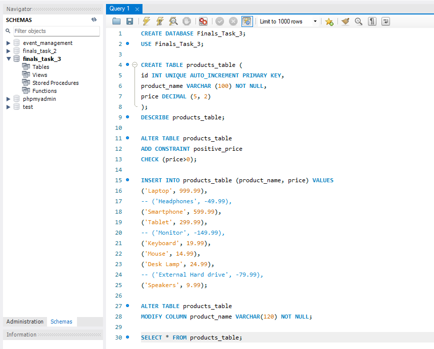
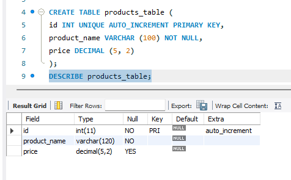
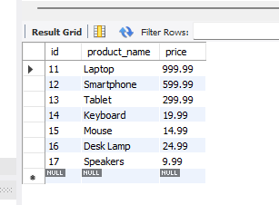
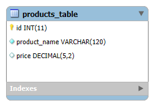

# Finals Lab Task 3: Table Manipulation

## Task Description:
This task focuses on altering tables and applying constraints using mysql. I created a product table, enforce business logic using a check constraint, insert valid data, and modify column definitions.

## Task Steps:
- Create products table
- add check constraint on price > 0
- insert only valid product records
- alter product_name to 120 characters

# MySQL Query Statements

# Table Structure Screenshots
# Product Table (without values)

# Product Table (with values)

# ER Diagram

# SQL Copy of the Database ->> [Table Manipulation](https://github.com/bangshiki/EDM-Portfolio/blob/1e49debaaec29aba01772913a64a2945cb03f2a9/Finals%20Task%203/files/Finals%20Task%203.sql)
