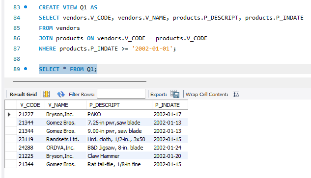
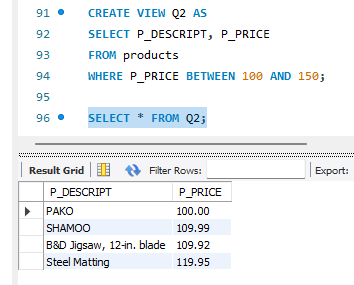
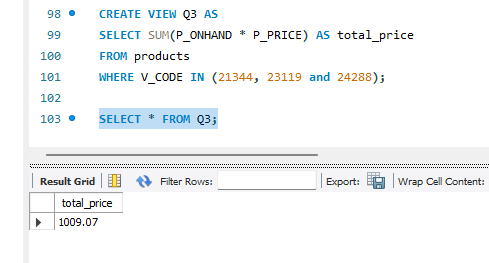
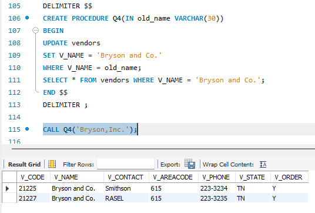
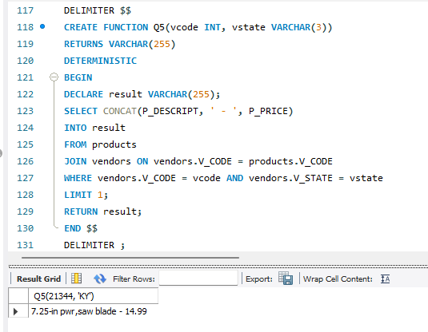

# Finals Lab Task 4: Using Stored PRocedures Views and Function
## Task Description:
This task involves working with the inventory database containing two tables: Products and Vendors. A series of Stored Procedures, Views, and Functions are created to extract and manipulate product and vendor information.

## Task Steps:
- Create a database named inventory, use inventory
- Copy and paste the initial query and perform the required operations for each problem.

# Query 1: Display all vendor products:

# Query 2: Call the stored procedure to retrieve products for a specific vendor:

# Query 3: Call the function to get the product description and price:

# Query 4: Call the stored procedure to update vendor name:

# Query 5: Create a view to display products within the price range 100–150:

# SQL Copy of the Database ->> [Using Stored PRocedures Views and Function](https://github.com/bangshiki/EDM-Portfolio/blob/b41e71a22cc56dfc573f8c9df1254194e8eeafab/Finals%20Task%205/files/Finals%20Task%205.sql)
