# Finals Lab Task 6: Mongo DB Practice
# Task Steps:

## Create database named mongo_practice:
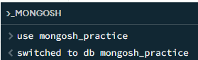

# Insert Documents:
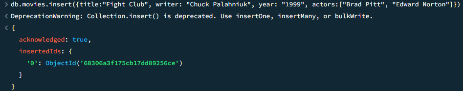
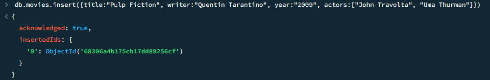
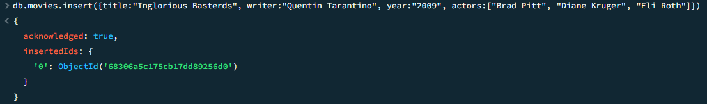
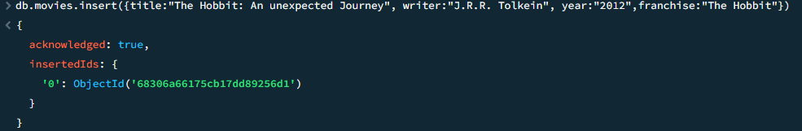
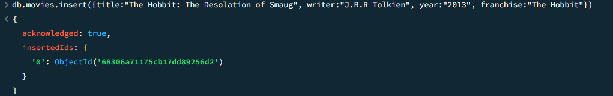
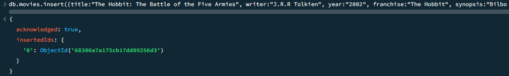
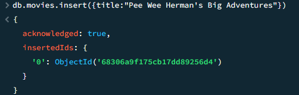
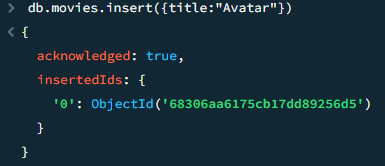

# Query / Find Documents
## 1. get all documents
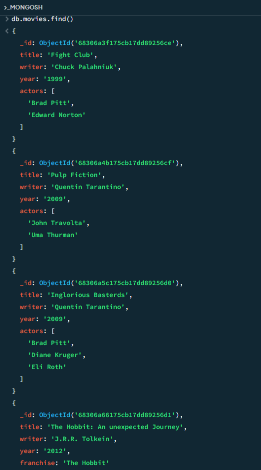

## 2. get all documents with `writer` set to "Quentin Tarantino"
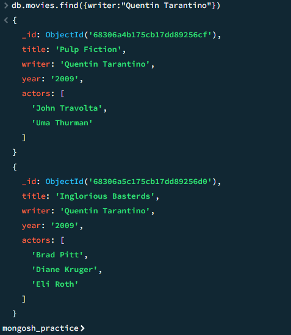

## 3. get all documents where actors include "Brad Pitt"
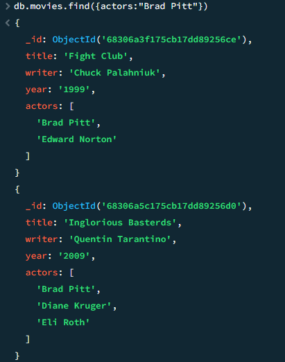

## 4. get all documents with franchise set to "The Hobbit"
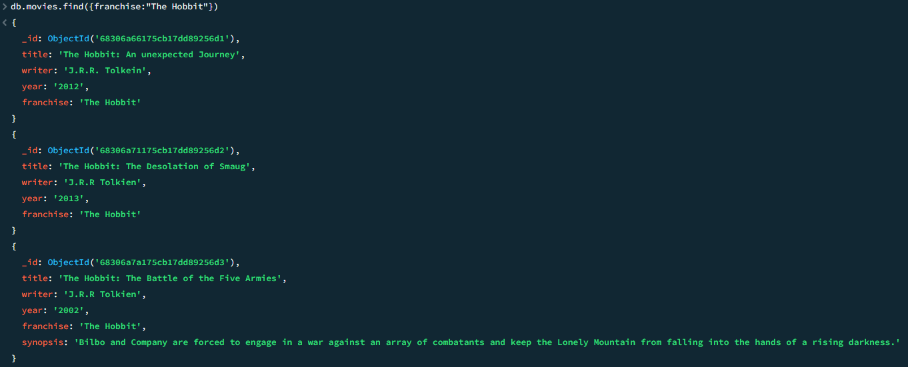

## 5. get all movies released in the 90s
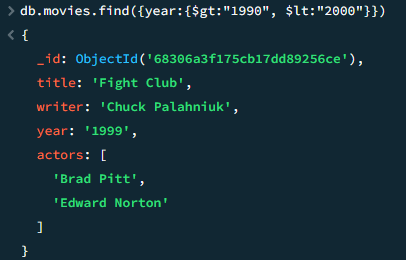

## 6. get all movies released before the year 2000 or after 2010
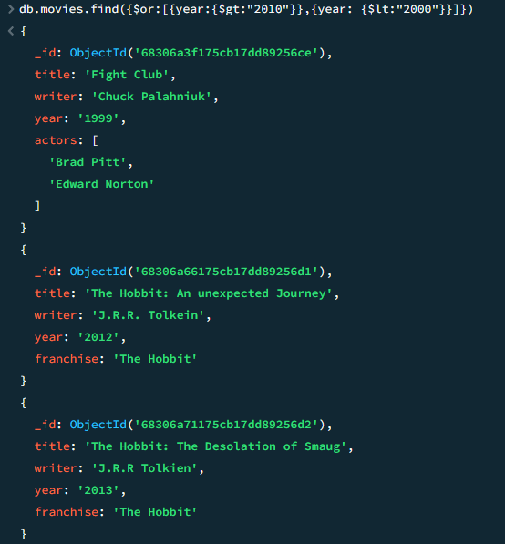

# Update Documents
## 1. add a synopsis to "The Hobbit: An Unexpected Journey" : "A reluctant hobbit, Bilbo Baggins, sets out to the Lonely Mountain with a spirited group of dwarves to reclaim their mountain home - and the gold within it - from the dragon Smaug."
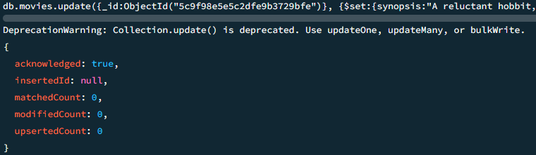

## 2. add a synopsis to "The Hobbit: The Desolation of Smaug" : "The dwarves, along with Bilbo Baggins and Gandalf the Grey, continue their quest to reclaim Erebor, their homeland, from Smaug. Bilbo Baggins is in possession of a mysterious and magical ring."
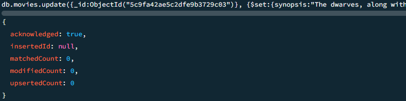

## 3. add an actor named "Samuel L. Jackson" to the movie "Pulp Fiction"
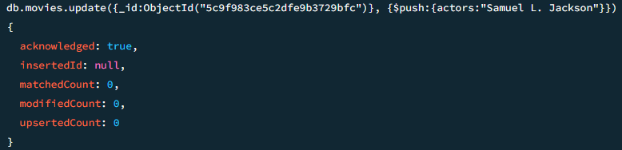

# Text Search
## 1. find all movies that have a synopsis that contains the word "Bilbo"
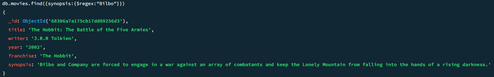

## 2. find all movies that have a synopsis that contains the word "Gandalf"
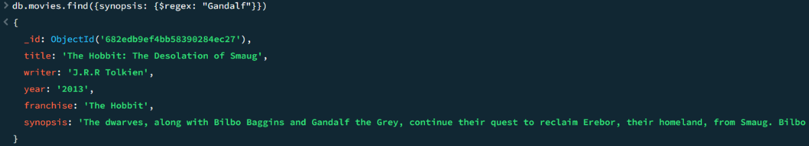

## 3. find all movies that have a synopsis that contains the word "Bilbo" and not the word "Gandalf"
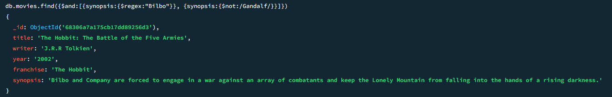

## 4. find all movies that have a synopsis that contains the word "dwarves" or "hobbit"
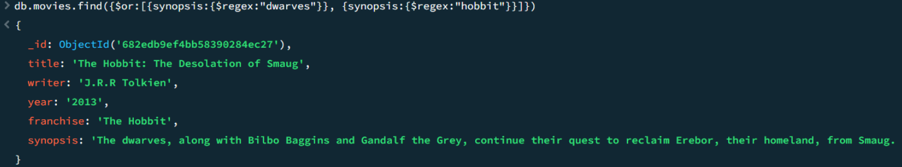

## 5. find all movies that have a synopsis that contains the word "gold" and "dragon"
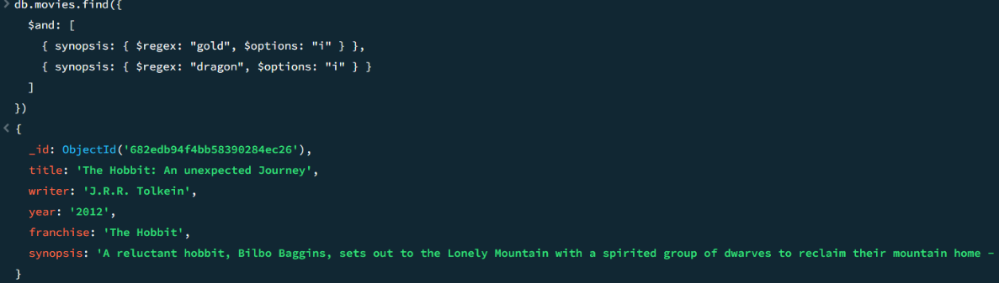

# Delete Documents

## 1. delete the movie "Pee Wee Herman's Big Adventure"
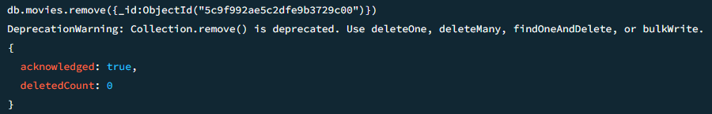

## 2. delete the movie "Avatar"
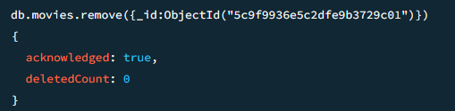

