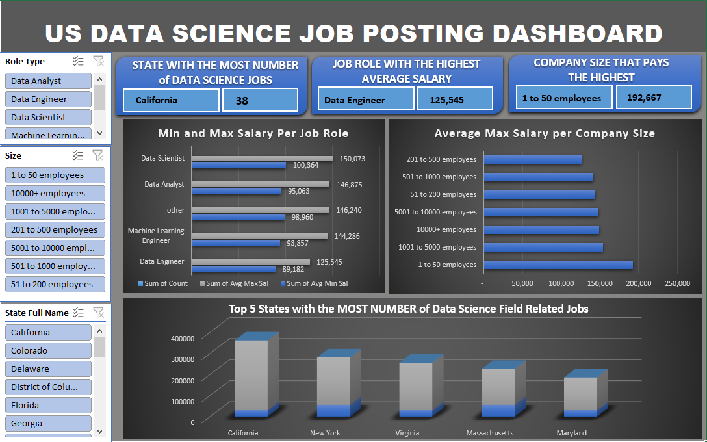

# Midterm Lab Task 3: Creating Pivot Table and Dashboard

## Task Description:
Create a Pivot Table-based dashboard using the provided dataset. Summarize salaries by job role, state, and company size. Design an interactive dashboard highlighting key insights using charts and slicers. Exclude the map visualization if unsupported and replace it with an alternative chart. Apply custom formatting for a polished presentation.

## Cleaning the Dataset:
Use the worksheet on "Uncleaned DS Jobs" and transform tables:
- Sal by Role
- Sal by State
- Sal by Size

## Creating Pivot Tables:
Create a Pivot Table for each of the following:
- Job roles and their average salaries
- States and their total number of Data Science jobs
- Company size and their highest average salaries

## Designing the Dashboard:
- Create a dashboard that includes:
- The state with the most Data Science jobs
- The job role with the highest average salary
- The company size that pays the highest

## Adding Visualizations:
- Use appropriate charts for each report (e.g., bar charts, column charts, or pie charts)

## Adding Slicers for Interactivity:
Insert slicers for:
- Role type
- Company size
- State

## Customizing the Dashboard:
Apply custom design and color settings to make it visually appealing and presentable.

# Excel Ouput:
Midterm Lab Task 3: [Creating Pivot Table and Dashboard](https://github.com/bangshiki/EDM-Portfolio/blob/0f1d7801f86916fff7b9faf17f5cccba65772017/Midterm%20Task%203/Excel/Midterm%20Task%203_done.xlsx)

# Final output (screenshot of the final Dashboard):

